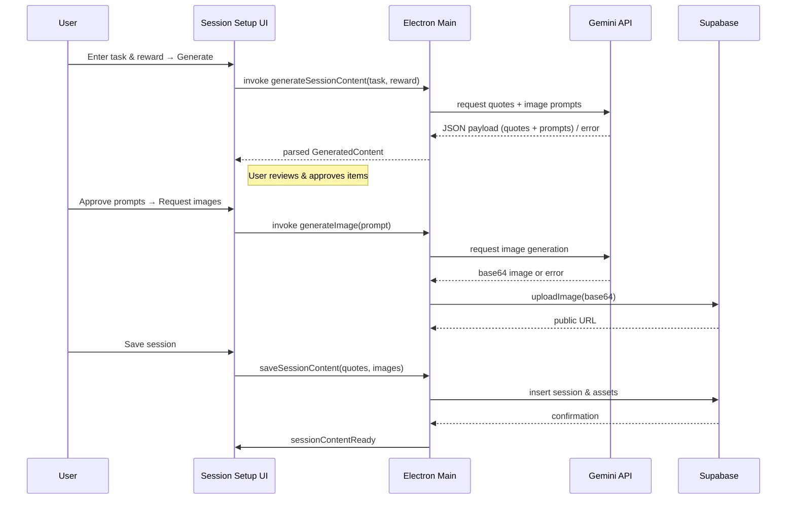
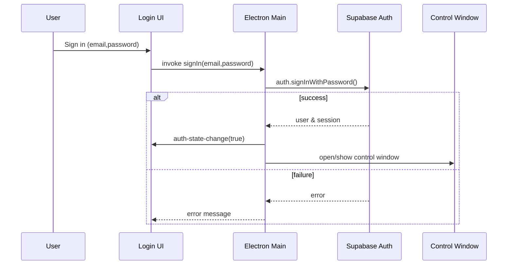

# Anchor 🎯

[](https://www.electronjs.org/)
[](https://www.python.org/)
[](https://www.typescriptlang.org/)
[](LICENSE)

> An interactive attention redirection system that externalizes the cognitive act of refocusing through physical interaction.

## Abstract

Maintaining sustained attention is a significant challenge in the modern digital environment, particularly for individuals with neurodevelopmental conditions like ADHD. This capstone project, "Anchor," introduces an interactive system designed to combat distraction by externalizing and reinforcing the cognitive act of attentional redirection. The system pairs a physical input device (a smart ring) with a companion desktop application. Upon recognizing a moment of distraction, the user clicks the button in the smart ring, triggering immediate, personalized, AI-generated motivational content via the software interface. Each click event is logged, enabling the system to provide a data-driven dashboard that visualizes focus patterns over time. The project culminates in a complete software system that implements the core feedback, visualizations, motivation, and analytics features. To prototype the intended smart ring interaction, user input is handled by reverse-engineering the Bluetooth connection of a commercial tallying ring, which serves as a proof-of-concept controller for the core feedback loop. The hypothesis is that by translating the mental act of attentional redirection into a physical form, like a simple click, users can separate the refocus action from self-judgment and guilt, thereby building a stronger and less mentally taxing habit of attention redirection. This project also includes a theoretical exploration of how the collected dataset could be utilized by machine learning algorithms in future iterations to deliver predictive nudges and increasingly personalized reinforcement.

## 🚀 Quick Start

### Prerequisites

- **Node.js** (v18+)
- **Python** (v3.8+)
- **Bluetooth LE** compatible device (tested with Zikr Ring Lite)
- **Windows** (currently tested on Windows 11)

### Installation

```bash
# Clone the repository
git clone https://github.com/adam-ajroudi/Anchor.git
cd Anchor

# Install Python dependencies
pip install bleak asyncio

# Install Electron dependencies
cd FocusRing-MVP-main
npm install

# Build TypeScript
npm run build
```

### Running the Application

```bash
# From the FocusRing-MVP-main directory
npm start
```

The application will:
1. ✅ Start the Electron desktop app
2. 🔍 Scan for the Bluetooth ring ("Zikr Ring Lite")
3. 🔗 Connect automatically when found
4. 📱 Display a status window showing connection progress

## 🎮 Usage

### Triggering Focus Overlay

**Method 1: Bluetooth Ring**
- Press the button on your Zikr Ring Lite
- A random motivational image appears on screen

**Method 2: Keyboard Shortcut**
- Press `Alt+F` to manually trigger the overlay
- Press again to hide

### Adding Your Own Images

Simply drop any images into the `FocusRing-MVP-main/images/` folder:
- Supported formats: `.png`, `.jpg`, `.jpeg`, `.gif`, `.webp`, `.bmp`
- Images are automatically detected on startup
- A random image is selected each time the overlay appears

## 🏗️ Architecture

```
┌─────────────────┐          ┌──────────────────┐
│  Bluetooth Ring │  Button  │  Python Script   │
│  (Zikr Ring)    │ ────────>│    (main.py)     │
└─────────────────┘  Press   └──────────────────┘
                                      │
                                      │ stdout
                                      ▼
                              ┌──────────────────┐
                              │  Electron App    │
                              │   (main.ts)      │
                              └──────────────────┘
                                      │
                         ┌────────────┴────────────┐
                         ▼                         ▼
                  ┌─────────────┐         ┌─────────────┐
                  │   Overlay   │         │   Status    │
                  │   Window    │         │   Window    │
                  └─────────────┘         └─────────────┘
```




**Key Components:**
- **`main.py`**: Bluetooth listener that detects ring button presses
- **`FocusRing-MVP-main/src/main.ts`**: Electron main process, coordinates all windows
- **`FocusRing-MVP-main/src/renderer.ts`**: Overlay window renderer
- **`FocusRing-MVP-main/src/preload.ts`**: IPC bridge (context isolation)

## 📁 Project Structure

```
Anchor/
├── main.py                          # Bluetooth ring listener
├── ziker.py                         # BLE service scanner utility
├── FocusRing-MVP-main/             # Electron application
│   ├── src/
│   │   ├── main.ts                 # Main process (orchestrator)
│   │   ├── renderer.ts             # Overlay renderer
│   │   ├── preload.ts              # IPC bridge
│   │   ├── index.html              # Overlay UI
│   │   └── status.html             # Status window UI
│   ├── images/                     # Motivational images
│   ├── dist/                       # Compiled JavaScript (gitignored)
│   ├── package.json
│   └── tsconfig.json
└── Docs/                           # Documentation
    ├── ARCHITECTURE.md
    ├── INTEGRATION_SUMMARY.md
    ├── DEBUGGING_GUIDE.md
    └── BLUETOOTH_STATUS_WINDOW.md
```

## 📚 Documentation

| Document | Description |
|----------|-------------|
| [**Architecture Overview**](Docs/ARCHITECTURE.md) | System design, data flow, and component interaction |
| [**Setup Instructions**](FocusRing-MVP-main/SETUP_INSTRUCTIONS.md) | Detailed installation and configuration guide |
| [**Integration Summary**](Docs/INTEGRATION_SUMMARY.md) | How Bluetooth and Electron components work together |
| [**Debugging Guide**](Docs/DEBUGGING_GUIDE.md) | Troubleshooting common issues |
| [**Bluetooth Status Window**](Docs/BLUETOOTH_STATUS_WINDOW.md) | Connection monitoring features |

## 🧪 Testing the System

### Manual Testing Checklist

1. **Bluetooth Connection**
   ```bash
   # Test standalone Python script
   python main.py
   # Should detect and connect to ring
   ```

2. **Image Display**
   - Add test images to `FocusRing-MVP-main/images/`
   - Run `npm start`
   - Press ring button or `Alt+F`
   - Verify random image appears centered on screen

3. **Graceful Shutdown**
   - Run the app, wait for Bluetooth connection
   - Press `Ctrl+C` to stop
   - Check logs for "Bluetooth device disconnected successfully"
   - Restart app - should reconnect immediately

### Expected Behavior

✅ **On Startup:**
```
App path: C:\...\FocusRing-MVP-main
Scanning images directory: C:\...\images
Found 4 image(s):
  0: 1.png - Exists: true
  1: 2.jpg - Exists: true
  ...
Alt+F registered successfully.
[Python]: Scanning for 'Zikr Ring Lite'...
[Python]: Found device: XX:XX:XX:XX:XX:XX. Connecting...
[Python]: Successfully connected to XX:XX:XX:XX:XX:XX
```

✅ **On Button Press:**
```
----> BUTTON PRESSED! <----
Bluetooth ring button detected - toggling overlay
Showing random image 3/4: 3.jpg
Successfully loaded image (image/jpeg)
```

## 🔬 Technical Features

### Current Implementation
- ✅ **Dynamic Image Loading**: Automatically scans images folder
- ✅ **Random Selection**: Different image each trigger
- ✅ **Graceful Bluetooth Disconnection**: Proper cleanup on exit
- ✅ **Dual Input Methods**: Ring button + keyboard shortcut
- ✅ **Real-time Status Window**: Connection monitoring
- ✅ **Automatic Reconnection**: Retry logic for dropped connections
- ✅ **Cross-process Communication**: Python ↔ Electron via stdout

### Reverse-Engineered Bluetooth Protocol
The system uses the **Zikr Ring Lite** as a proof-of-concept input device:

## 🛠️ Development

### Build Commands

```bash
cd to FocusRing-MVP-main

# Production build
npm run build

# Start application
npm start
```


## 👤 Author

**Adam Ajroudi**  
Capstone Project - [GitHub Repository](https://github.com/adam-ajroudi/Anchor)

## 🙏 Acknowledgments

- Reverse-engineered Bluetooth protocol from Zikr Ring Lite device
- Built with Electron, TypeScript, and Python Bleak
- Inspired by research on attention management and ADHD support systems

